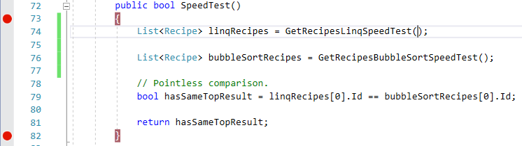
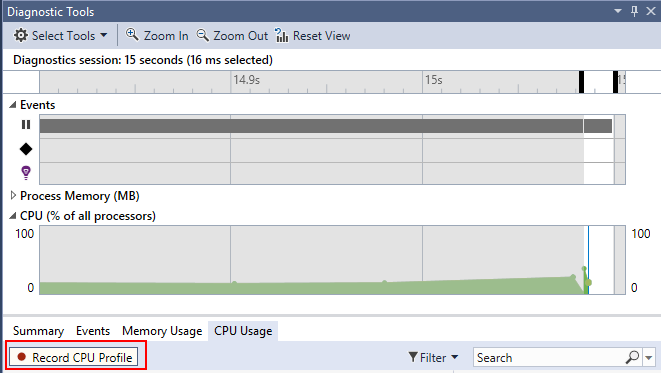
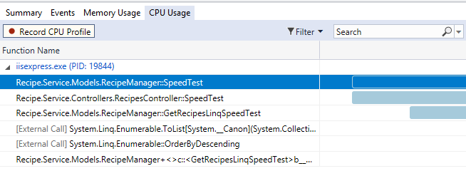
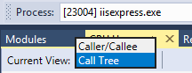

# CPU Usage
While your debugging your app in Visual Studio you can also profile your application to better understand it's performance. 

## Prerequisites

1. Set `Recipe.Service` as the **Startup Project**

## Example
1. Set breakpoints at the start and end of `SpeedTest` in **line 73** and **line 82** of `RecipeManager.cs`.

2. Launch the application **F5**.
3. Navigate the browser too `localhost:64407/api/recipes/speedtest`.
4. Go to the CPU tab in the diagnostic tools  **Diagnostics Tools -> CPU**.
5. Press **Record CPU Profile**.

6. Continue the debuggeer **Continue/F5**.
7. Wait for the profile datat to be processed (It may look like nothing is happening - but it is!). When it's done you should see a graph like the one below.

8. **Double Click* one of the functions to bring up the **Caller/Callee* view. 

**Bonus Tip**: Select the **Call Tree** view in the top right dropdown to get an overview of what was going during the profile.

## Notes

1. If you encounter an issue where you don't see any samples you will need to start CPU recording when your app launches. Just leave it on when you stop debugging and then relaunch the app.
2. The profiler in Visual Studio uses CPU sampling to collect performance information. Samples are taken every ms so if your code runs fast not many smaples will be collected. Profiling works best if you can overload, even temporarly, the size of the profile by adding more items to a collection or by running the code mulitple times.