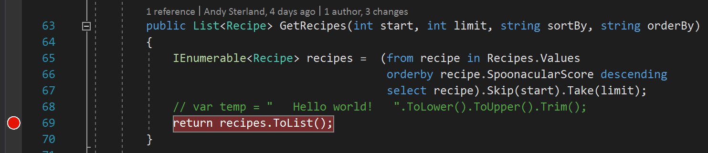
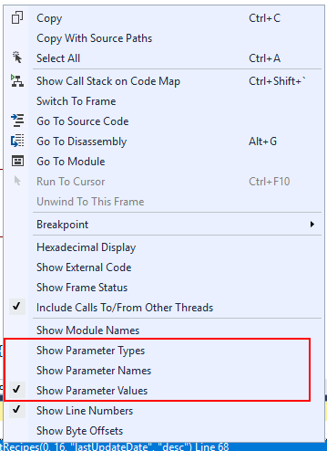
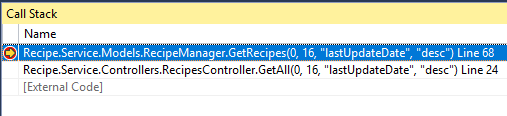

## Call Stack Parameter Values
The **Call Stack** window can be customized to show a variety of different properties on each frame in the stack. One of the most useful is showing the values that were past into each function. This gives you a quick view of the inputs passed into each function.

### Example - Just Values
1. Navigate to the **Recipe.Service** project and in **Models/RecipeManager.cs**, set a breakpoint on **line 69** in the `GetRecipes()` function. 

2. Launch the application and hit the breakpoint.
3. In the **Call Stack Window**, right-click on a call frame to open the context menu.

4. Select **Show Parameter Values**. 

### Notes
There are a bunch of options to configure how to customize the look of the callstack window to suit you. Have a play with them and figure out what works for you! 