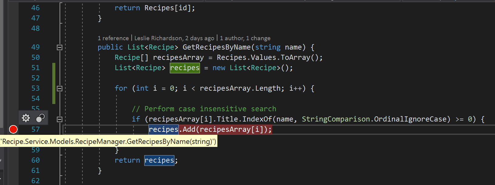
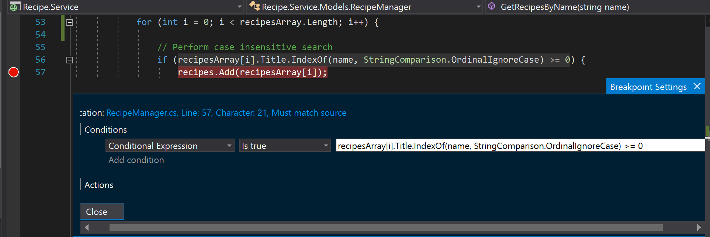

# Conditional Breakpoints

**Conditional breakpoints** allow you to break if a specified logic condition is satisfied. In this application,conditional breakpoints can be used to notify you when a search match has been found.

1.	In the **Recipe.Service** project, navigate to the **GetRecipesByName()** function in **Models/RecipeManager.cs** file.

2.	Set a breakpoint at **line 57**.

3.	Hover over the breakpoint and select the **Settings** gear icon that appears. 

4.	Check the **Conditions** option.  Make sure the first dropdown is set to **Conditional Statement**, the second dropdown is set to "is true" and enter the following in the textbox:

    `recipesArray[i].Title.IndexOf(name, StringComparison.OrdinalIgnoreCase) >= 0`

Performing this step means that a break will occur when the above conditional statement is true, such that a recipe contains the user-specified substring in its name, thus adding the recipe as a search result.

5.	Restart the application if you are still in debug mode or start it normally.  In the search box, enter **“chocolate”** and run the search.  In Visual Studio, a break should have occurred at the location where you created the breakpoint after clicking the search button because a match has been found.

6.	Hit the **Continue** button twice in the Debug toolbar and a break at the same location should occur two more times before all three found matches are displayed in the application.

