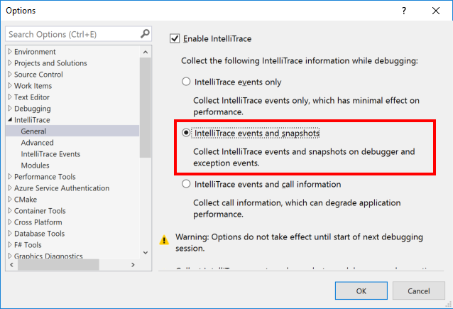

# IntelliTrace - Enabling Snapshots
IntelliTrace is part of Visual Studio Enterprise, one of the most compelling features of IntelliTrace is the new *snapshot* feature. The snapshot feature powers the *Step Back* and snapshots expception features of IntelliTrace. With these feature you can look back at the state of your application as it was at a point in the past with full fidelity.  

## Enabling via Tools Options 
1. Open the *Tools* > *Options* dialog and locate the *IntelliTrace* > *General* options and select the *IntelliTrace Events and snapshots*

Snapshots are will be enabled starting with the next debug session. 

## Enabling via Step Back
1. Launch any application and hit a breakpoint.
2. Locate the *Step Back* button in the stepping controls command bar.
3. Press *Step Back*
4. A "gold bar" should in the top of the editor

Snapshots are will be  enabled starting with the next debug session. 