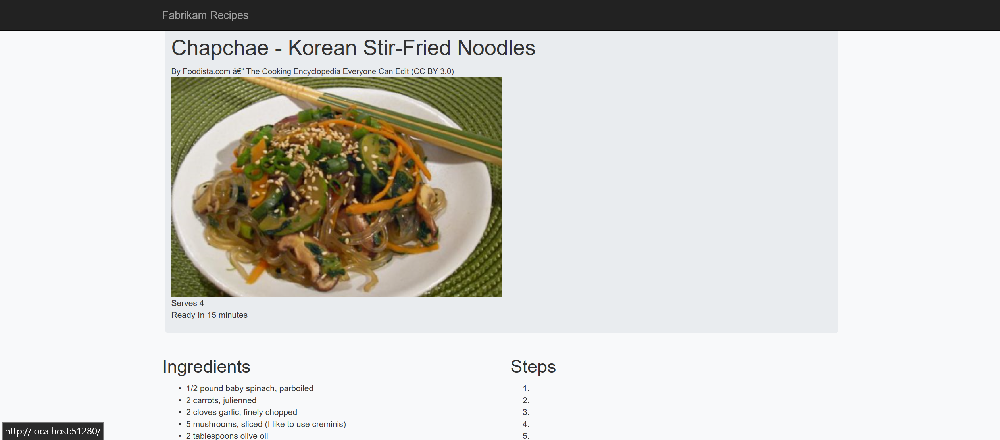

# In-Depth Debugging: Tips & Tricks for Debugging in VS 2017

# Lab Introduction
As a casual or professional developer, you probably spend a lot of time debugging your code, sometimes longer than it takes to write your code.  While debugging can be repetitive, tedious, and time-consuming, Visual Studio contains a wide variety of features to create a faster, more productive debugging experience.  This lab will go beyond the basic console logs, breakpoints, and stepping mechanics to explore the more advanced debugging, diagnostic, and profiling tips and tricks that Visual Studio has to offer!

# What is Covered in this Lab?
This lab will cover many debugging and profiling features including but not limited to the following:
* Customizable Breakpoints
* IntelliTrace (i.e. Snapshots, Step Back, etc.)
* Alternative Code Navigation
* CPU & Memory Usage
* Watch / Local Window Tags

# Lab Setup 
This lab will use a fictional application called Fabrikam Recipes, an app where recipes can be viewed and searched for.  This application consists of a .NET Web API service and a .NET Core MVC client. 

In Visual Studio, under **File--> Open--> Project/Solution**, open the **vs-diagnostics-demo-recipe-app --> src --> recipe-demo.sln** solution file.


**NOTE:** Because each of the following exercises has components that build from previous ones, try completing these exercises in the order they are written.


# Section 1: Multiple Startup Projects
If you have a solution with multiple projects, Visual Studio can launch any number of those projects when you press **F5** in the IDE.  The recipe application consists of a .NET Web API project and a .NET Core MVC project. Each of these projects need to be running simultaneously, so we need to establish multiple startup projects.

1. In **Solution Explorer** find the solution root node.


2. **Right Click -> Properties** - It's the last item on the context menu. You can also do **Right Click -> Set Startup Project..** to accomplish the same task.


3. In the dialog that appears choose **Multiple startup projects**.


4. Set `Recipe.PublicWebMVC` and `Recipe.Service` to **Start**.

5. Now press *F5* and you should see two browsers launches at the startup page for each project.


# Section 2: Excecution Control Features

## Exercise 2.1: Break On Exception
When exceptions are thrown at runtime, you are typically given a message about it in the console window and/or browser, but you would then have to set your own breakpoints to debug the issue.  However, Visual Studio also allows you to **break when an exception is thrown** automatically, regardless of whether it is being handled or not.

1.	In the application, type **“Grilled Lemon Chicken”** in the search box and hit the Search button.  An error message about an unhandled `NullReferenceException` should appear in the browser.  Though the message highlights a line of code in an html page, the message does not explicitly state where the null reference is located.


2.	In Visual Studio, while the app is still running, navigate to the **Exception Settings** window.  Under the **Common Language Runtime Exceptions** tab, locate and check the `System.NullReferenceException` option.


3.	Use **Ctrl+Shift+F5** or select the **Refresh** icon in the Debug toolbar to restart the app without having to stop and start the debugging environment.  

4.	Try typing **“Grilled Lemon Garlic Chicken”** in the application’s search box again and hit the Search button.  Visual Studio will automatically break at the point in code where the `NullReferenceError` was thrown.

  

5.	Based on the **Exception Thrown** pop-up that appears at the breakpoint, it’s revealed that the `recipes` List variable was initialized as null in the function that returns searched recipes.  At **line 51**--the location where the recipes list is first defined--change the code to the following: 

    `List<Recipe> recipes = new List<Recipe>();`

6.	Restart the application and attempt to search for “Grilled Lemon Garlic Chicken” once more.  The search should be successful now that the `recipes` list has been initialized correctly.


## Exercise 2.2: Run To Cursor
While there are the usual breakpoints and stepping mechanics to move from one line of code to the next, these options require setting temporary breakpoints or multiple steps to execute your code or stop to the line you want.  Using **Run to Cursor**, a hidden breakpoint can be made at the location of your cursor, starting the debugger automatically and stopping at the selected line without the need of step-by-step debugging.

1.	In the **Recipe.Service** project, navigate to the **GetRecipesByName()** function in the **Models/RecipeManager.cs** file.

2.	Set a breakpoint at **line 49** and run the application.

3.	In the recipe application’s search box, enter **“butter”**. Execute the search.

4.	In Visual Studio, right click on **line 51** and select the **“Run to Cursor”** option in the context menu that appears.


5.	Hover over the recipes array in **line 51** and check that it’s null in the DataTip.


6.	A keyboard shortcut can also be used to execute a Run to Cursor.  To skip over the for loop, click anywhere on **line 61** (end of search function bracket) and hit **Ctrl + F10**.

7.	Hover over the recipes array at **line 60** to view its DataTip and check that the size is 3, the corresponding number of matching recipes found in the application containing “butter” in their names.


## Exercise 2.3: Run To Click
An alternative to Run to Cursor is **Run to Click**.  Instead of using a context menu or keyboard shortcut to run execution to a specified line of code, Run to Click allows you to perform the same task by a simple point and click.

1.	In the **Recipe.Service** project, navigate to the **GetRecipesByName()** function in **Models/RecipeManager.cs** file.

2.	Set a breakpoint at **line 49** and run the application.

3.	In the recipe application’s search box, enter **“butter”**. Execute the search.

4.	In Visual Studio, hover over **line 51** and select the green arrow **“Run to Execution Here”** glyph that appears on the left side of the code.


5.	Hover over the recipes array in **line 51** and check that it’s null in the DataTip.

6.	Hover over line 61 and select the **“Run to Execution Here”** glyph.

7.	Hover over the recipes array at **line 60** to view its DataTip and check that the size is 3, the corresponding number of matching recipes found in the application containing “butter” in their names.

## Exercise 2.4: Set To Next Statement
While Run to Cursor and Run to Click will execute your application up to where you choose to break, **Set to Next Statement** allows you jump around your code without executing any code in-between. Set to Next Statement is a good feature to use when you want to skip over buggy code while debugging or when you want to re-execute code after an edit has been made.

1.	In the **Recipe.Service** project, navigate to the **GetRecipesByName()** function in **Models/RecipeManager.cs** file.

2.	Set a breakpoint at **line 49** and run the application.

3.	In the recipe application’s search box, enter **“butter”**. Execute the search.

4.	In Visual Studio, right click on **line 58** and select the **“Run to Click”** glyph to run execution up to **line 58**, the end of the first loop iteration.  You can check that the recipes array contains only 1 item.

5.	Drag the yellow arrow on the left of **line 58** to **line 60**. Hover over the recipes array to observe that it still contains only 1 item.  You can also perform the same task by right-clicking and selecting **“Set to Next Statement”** in the context menu or by using the keyboard shortcut **Ctrl+Shift+F10** after putting your cursor on the desired line.


6.	Hit **Continue** on the Debug toolbar to view the application’s search results.  Unlike the results of the Run to Click and Run to Cursor sections which displayed 3 search results containing the “butter” substring, this search will only display the first result because we skipped the rest of the `for` loop’s execution.


7. Delete the breakpoint.


## Exercise 2.5: Conditional Breakpoints

**Conditional breakpoints** allow you to break if a specified logic condition is satisfied. In this application,conditional breakpoints can be used to notify you when a search match has been found.

1.	In the **Recipe.Service** project, navigate to the **GetRecipesByName()** function in **Models/RecipeManager.cs** file.

2.	Set a breakpoint at **line 57**.

3.	Hover over the breakpoint and select the **Settings** gear icon that appears. 


4.	Check the **Conditions** option.  Make sure the first dropdown is set to **Conditional Statement**, the second dropdown is set to "is true" and enter the following in the textbox:

    `recipesArray[i].Title.IndexOf(name, StringComparison.OrdinalIgnoreCase) >= 0`


Performing this step means that a break will occur when the above conditional statement is true, such that a recipe contains the user-specified substring in its name, thus adding the recipe as a search result.

5.	Restart the application if you are still in debug mode or start it normally.  In the search box, enter **“chocolate”** and run the search.  In Visual Studio, a break should have occurred at the location where you created the breakpoint after clicking the search button because a match has been found.

6.	Hit the **Continue** button twice in the Debug toolbar and a break at the same location should occur two more times before all three found matches are displayed in the application.


## Exercise 2.6: Tracepoints

**Tracepoints** are breakpoints that allow you to print messages and values to the output window without having to halt program execution or break at that specific point while debugging.

1.	Using the same breakpoint made during the conditional breakpoint exercise, hover over the breakpoint and select the **Settings** gear icon that appears.

2.	Un-check the **Conditions** option if you haven't already. Check the **Actions** option and enter the following in the **"Log a Message to Output Window"** textbox:

    `{recipesArray[i].Title} found at index {i}`

    The curly braces around the entered variables indicate that the variable’s value will be printed to the output window.  For more information about additional keywords that can used in tracepoints, hover over the info icon to the right of the textbox.


3.	Hit **ENTER** to save the tracepoint log message and make sure **“Continue Execution”** is checked so that a break does not occur every time a message is logged.  Uncheck the **Conditions** option if it isn’t unchecked already and select the **Close** button to exit the menu.

4.	Restart the application and search for “chocolate” in the search box.

5.	In Visual Studio’s **Output Window**, hit **Ctrl+F** and enter “chocolate peanut” in the search box to locate the log messages you created with the tracepoint.


6. Delete the tracepoint.

## Exercise 2.7: Function Breakpoints

Function Breakpoints allow you to run your application until a specific function is called.  A function breakpoint can be used to check that the client is correctly calling the `GetRecipesByName()` function.  This feature is useful when you know the function name you want to break at but are unsure about where that function is located.

1.	Choose **Debug --> New Breakpoint --> Break at Function**.

2.	Enter **“GetRecipesByName”** and hit **ENTER**.  You can view this breakpoint in the **Breakpoints** tab.

3.	Run the application.  In the search box, enter “chocolate” and execute the search.  You should be able to see a break occur at the function’s location when `GetRecipesByName()` is called.


4.	Delete the function breakpoint by selecting it and clicking the red delete “X” icon above or by right clicking the breakpoint and selecting **Delete** in the context menu.  (This step is so we don’t automatically break at this function for the remainder of the lab).


# Section 3: Inspection Features

## Exercise 3.1: Pinned DataTips
When you hover over a variable in Visual Studio, a DataTip is displayed that allows you to inspect the object. DataTips are dismissed when you move the mouse cursor outside the DataTip, which can be frustrating. If you want to keep the DataTip around, just use the pin icon on the left to 'pin' it in the editor and keep it in place.

1. Pause the debugger.
2. Hover over a variable. 


3. Use the 'pin' icon on the right-hand side of the DataTip (highlighted in red below).


4. Use the DataTip to your heart's content.


## Exercise 3.2: No Side Effect Expression Evaluation
Adding an expression to the watch window(s) will cause that expression to be evaluated in the context of where the debugger is paused. This is great, it allows you to inspect anything you want, or even execute code, the downside is that it can cause 'side effects' which in this case means you could alter the state of your application. Which is not so great, now normally this doesn't matter as most of the time the expressions you will be evaluating will typically, at worse, just result in a getter getting invoked. As getters should be idempotent and calling them should thus never change the state of your application side effects shouldn't be a problem, but if they are... You can use the `nse` format specifier after the expression, like so:

`<expression>, nse`

### Example: Executing Code in Watch Expressions
In this example we'll be executing some code in a watch expression that will change the state of a variable to illustrate the effect of `,nse` on watches.

1. Navigate to **Recipe.Service** Set a breakpoint at **line 24** in **Controllers/RecipesController.cs**.


2. Launch the application and navigate to the root page. This should cause the controller above to run and the breakpoint to hit.

3. Back in VS go to the **Watch Window** and enter the expression `limit`.


4. Add a new watch with the expression `limit++` this will cause the value of `limit` to increment.


5. Clear the `limit++` watch.

6. Add a new watch with the expression `limit++, nse`.


7. Note how the value of limit is not increment again and stays at it's previous value.


### Example: Getters with Side Effects
In this example we have some crazy code that is using an IEnumerator in a getter property to return an item. The problem with this approach is that every time the property is accessed the getter will cause the iterator to move to the next item. 

```
private IEnumerator<long?> keysEnumerator;
public Recipe NextRecipe
{
    get
    {
        if (!keysEnumerator.MoveNext())
        {
            keysEnumerator.Reset();
        }

        return Recipes[keysEnumerator.Current];
    }
    set { }
}
```
**Warning: The above is an insane property - getters should be idempotent.**

1. In the **Recipe.Service** project, add the above code to the bottom of **Models/RecipeManager.cs**. 

2.  In the `RecipeManager` constructor after the `foreach` loop, add the following code:

    `keysEnumerator = Recipes.Keys.GetEnumerator();`

3. In the **Recipe.Service** project, set a breakpoint at **line 24** in **Controllers/RecipeControllers.cs**.

4. Run the application, which should cause the breakpoint to hit.

5. In the **Watch Window** add the expression `RecipeManager.Singleton.NextRecipe, nse`.

6. Inspect the watch window item. 

This illustrates how `, nse` works. You can think of `,nse` as executing the code involved but without writing back to your application. So in this case when you look an item with `,nse` you get the next item every time you inspect the object but your application isn't changed. 

7. Stop the application and delete the code you added during this exercise.

8. Delete the breakpoint.


## Exercise 3.3: Watch Window Results View 
When looking at collections in the watch window you can add a **format specifier** of `, results` to just look at all the items in a collection.

1. Navigate to the **Recipe.Service** project and in **Models/RecipeManager.cs**, set a breakpoint on **line 69** in the `GetRecipes()` function. 


2. Launch the application and hit the breakpoint.
3. Add a watch value of `recipes`.


4. Add a watch value of `recipes, results` and note how the items in the `IEnumerable` are children of the watch and no other properties are shown.


As you can see with the `, results` format specifier, the items in a collection are shown as children making it easier to view the items in a collection.


## Exercise 3.4: Number Formatting
In the watch window you can force the visualization of an int into either it's decimal or hexadecimal representation with the respective `,d` and `,h` format specifiers. This is especially useful for looking at values derived from HRESULTS.


1. Navigate to the **Recipe.Service** project and in **Models/RecipeManager.cs**, set a breakpoint on **line 69** in the `GetRecipes()` function. 


2. Launch the application and hit the breakpoint.
3. Add a watch value of `limit`.
4. Add a watch value of `limit, h` to see the hexadecimal representation of `limit`.


### Context Menu
You can also accomplish the same thing with the **Hexadecimal Display** context menu item for a watch.


## Exercise 3.5: Return Values In Watch - `$ReturnValue`
In Visual Studio the watch window supports a number of [pseudovariables](https://docs.microsoft.com/en-us/visualstudio/debugger/pseudovariables) which can be used to inspect objects that are not part of the app being debugged. One of those pseudovariables is `$ReturnValue` which shows the return value for a function.


### Simple Example
1. Navigate to the **Recipe.Service** project and in **Models/RecipeManager.cs**, set a breakpoint on **line 69** in the `GetRecipes()` function. 


2. Launch the project and hit the breakpoint.
3. Press **Step Over (F10)**
4. In the **Watch Window**, add the expression `$ReturnValue`. You can now inspect the value that is being returned to the caller.


### Multiple Return Values
In addition to seeing the return value from a single function, you can also use the `$ReturnValue` pseudovariables to view the return values from chained expressions e.g. `foo().bar()`. Simply append a number that corresponds to a method's place in the chained expression in the `foo().bar()` example the return value for `foo()` would be `$ReturnValue1` and the return value for `bar()` would be `$ReturnValue2`.

1. Add the example code below to `RecipeManager.cs` **line 68**.

    `var temp = "   Hello world!   ".ToLower().ToUpper().Trim();`

2. Set a breakpoint on the newly added code at **line 68**.
3. Launch the application and hit the breakpoint.
4. In the **Watch Window** add the expressions `$ReturnValue`, `$ReturnValue1`,`$ReturnValue2`, and `$ReturnValue3`. 
5. Press **Step Over (F10)**


5. You can see that each of the `$ReturnValue{N}` correspond to the return values for each of the chained functions. 


## Exercise 3.6: Debugger Display Attribute
When inspecting objects in the debugger, a default representation of the object is shown. Typically for classes, it's just the class name which often isn't that useful. Instead you can control what the debugger shows by providing a `[DebuggerDisplay()]` attribute on the class definition. 


### Example - No [DebuggerDisplay()]
1. Navigate to the **Recipe.Service** project and in **Models/RecipeManager.cs**, set a breakpoint on **line 69** in the `GetRecipes()` function. 


2. Launch the application and hit the breakpoint.
3. Hover over the `recipes` object and expand the `ResultsView` note how each recipe just has their class name, which is not very useful.


4. Stop debugging.

### Example - With [DebuggerDisplay()]
Now let's add a `[DebuggerDisplay()]` attribute on the `Recipe` class to improve that visualization.

1. Open **Models/Recipe.cs** in the **Recipe.Service** project.
2. Add a `using` statement for `System.Diagnostics` at the top of the file.

`using System.Diagnostics;` 

3. Above the class declaration for `Recipe` on **line 11** add:

`[DebuggerDisplay("{Title,nq}")]`
 


_Bonus Tip_: The format specifier `,nq` 'no quotes' will cause strings to be displayed without quotation marks at the start and end of the string.

4. Launch the application and hit the breakpoint previously set on **RecipeManager.cs** on **line 69** in the `GetRecipes()` function.
5. Hover over the `recipes` object and expand the `ResultsView`. Note how each recipe now shows the title, which is much more useful and readable!


### Example - Expressions in Display Attributes
The `[DebuggerDisplay()]` attribute uses the same string formatting as **TracePoints** and other VS features allowing you to display more complex strings.

1. Back in **Models/Recipe.cs line 11** modify the `[DebuggerDisplayAttribute]` to:

`[DebuggerDisplay("{Title,nq}, id: {Id}")]`


2. Launch the application and hit the breakpoint previously set on **RecipeManager.cs line 69** in the `GetRecipes()` function.
3. Hover over the `recipes` object and expand the `ResultsView`. Note how each recipe now each shows the title and id.


### Further Documentation
For more information on `DebuggerDisplay`, take a look at the [documentation](https://docs.microsoft.com/en-us/visualstudio/debugger/using-the-debuggerdisplay-attribute) on docs.microsoft.com.


## Exercise 3.7: Call Stack Parameter Values
The **Call Stack** window can be customized to show a variety of different properties on each frame in the stack. One of the most useful is showing the values that were past into each function. This gives you a quick view of the inputs passed into each function.

### Example - Just Values
1. Navigate to the **Recipe.Service** project and in **Models/RecipeManager.cs**, set a breakpoint on **line 69** in the `GetRecipes()` function. 


2. Launch the application and hit the breakpoint.
3. In the **Call Stack Window**, right-click on a call frame to open the context menu.


4. Select **Show Parameter Values**. 


### Notes
There are a bunch of options to configure how to customize the look of the callstack window to suit you. Have a play with them and figure out what works for you! 


# Section 4: IntelliTrace

## Exercise 4.1: IntelliTrace - Enabling Snapshots
IntelliTrace is part of Visual Studio Enterprise, and one of the most compelling features of IntelliTrace is the new **snapshot** feature. Snapshot powers the **Step Back** and **Snapshot Exception** features of IntelliTrace. With these features, you can view the state of your application as it was at a point in the past with full fidelity.  

### Enabling via Tools Options 
1. Open the **Tools --> Options** dialog and locate the **IntelliTrace --> General** options and select the **IntelliTrace events and snapshots**


Snapshots will be enabled starting with the next debug session. 


## Exercise 4.2: IntelliTrace - Step Back
The **Step Back** feature of IntelliTrace allows you to inspect the state of your application at a previous point in time. This is really powerful if you want to go back and look at a particular state without having to rerun your scenario.

### Prerequisites
1. To enable Step Back follow the steps to [Enable Snapshots](EnableSnapshots.md).
2. Enable debugging only for **Recipe.Service** using the [Multiple Startup Projects Dialog](MultipleStartupProjects.md) (i.e. set the other two projects to **"Start without debugging"**.

### Step Back Example  

1. Set a breakpoint inside the `foreach` loop in **RecipeManager.cs line 36** in the constructor for `RecipeManager`. 


2. Launch the application and hit the breakpoint.
3. Press **Continue (F5)**. Each time the breakpoint is hit, a snapshot is taken, which can be viewed in the **Diagnostics Tools --> Events** tab. 
4. Inspect the `fileName` variable and take note of it's value.


5. Press **Step Back (Alt + [)**.


6. Inspect the `fileName` variable. Take note of its value and how it's the value from the previous iteration of the `foreach` loop.


7. Delete the breakpoint made at line 36.


## Exercise 4.3: Snapshots on Exceptions
The **Snapshots on Exceptions** feature of IntelliTrace takes snapshots of your application when an exception occurs. You can then use the **Diagnostic Tools** window to inspect that exception and the entire state of your application when the exception occurred.

### Prerequisites
1. To enable Snapshots on Exceptions follow the steps to [Enable Snapshots](EnableSnapshots.md).
2. Enable debugging only for **Recipe.PublicWebMVC**  using the [Multiple Startup Projects Dialog](MultipleStartupProjects.md).

### Example - Exceptions

1. Start debugging (`F5`).
2. Navigate the browser to `http://localhost:61906/`.
3. Choose a recipe and click on it to navigate to it's details page (e.g. `http://localhost:61906/home/recipe/715702`). You should get an error page but not stop in the debugger.
4. Go to Visual Studio and open the **Diagnostic Tools Window** (it should already be open on the right hand side).
5. Go to the **Events** tab. 
6. In the **Filter Events** box type **"exception"** to filter the list down to just the exceptions.
7. Select the **Exception** event with the **snapshot** icon as displayed below(). This indicates that a snapshot was taken for this exception.


8. Double-click on the event or click on **Activate Historical Debugging** link.
9. Visual Studio is now debugging the exception that caused the `View` to fail to render!  

### Example - Async Exceptions
The snapshot feature is really powerful when debugging code that is using `await` or other async patterns. One of the challenges with `async` code is that an exception that has occurred previously might be responsible for an exception that you are currently debugging. Since the code is `async`, the app being debugged has moved on and none of the state from that previous point in time exists, so you can't inspect. This is where snapshots on exceptions really comes into it's own.

1. Follow the steps in the example above.
2. Looking at the exception, it doesn't really tell us anything useful. Clearly `recipe` is `null` but the question is, why? Something earlier returned `null` and but because it was an `async` `Task`, it can't be inspected from this location.


3. In the **Diagnostic Tools Window** activate the first, oldest, exception (there should be 3) and look at the code. As you can see, this is the source of the problem, the hostname for the API endpoint is incorrect.


4. To fix this issue, in the **Controllers/HomeController.cs** file, change `badhost`to `localhost` at **line 73**.


5. Run the application and click on any recipe.  It should correctly send you to the recipe's detail page.




# Conclusion
Over the course of this lab, a wide array of Visual Studio debugging and profiling features were explored in the context of a web application. The next time you find yourself debugging your code in Visual Studio, try using these tips and tricks to make your debugging experience a more efficient, delightful one.


