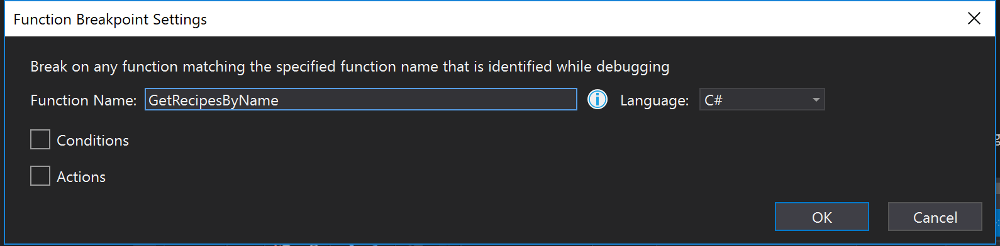
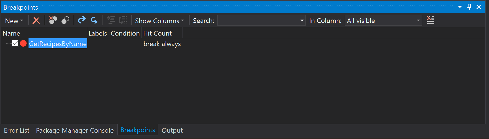

# Function Breakpoints

Function Breakpoints allow you to run your application until a specific function is called.  A function breakpoint can be used to check that the client is correctly calling the GetRecipesByName() function.
1.	Choose **Debug --> New Breakpoint --> Break at Function**.

2.	Enter *“GetRecipesByName”* and hit **ENTER**.  You can view this breakpoint in the **Breakpoints** tab.

3.	Run the application.  In the search box, enter “chocolate” and execute the search.  You should be able to see a break occur at the function’s location when `GetRecipesByName()` is called.

4.	Delete the function breakpoint by selecting it and clicking the red delete “X” icon above or by right clicking the breakpoint and selecting **Delete** in the context menu.  (This step is so we don’t automatically break at this function for the remainder of the lab).

