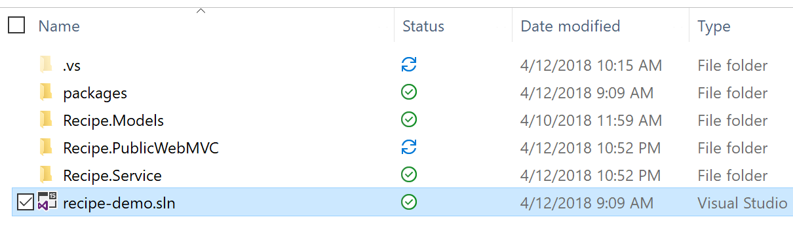

# Lab Introduction
As a casual or professional developer, you probably spend a lot of time debugging your code, sometimes longer than it takes to write your code.  While debugging can be repetitive, tedious, and time-consuming, Visual Studio contains a wide variety of features to create a faster, more productive debugging experience.  This lab will go beyond the basic console logs, breakpoints, and stepping mechanics to explore the more advanced debugging, diagnostic, and profiling tips and tricks that Visual Studio has to offer.

# What is Covered in this Lab?
This lab will cover many debugging and profiling features including but not limited to the following:
* Customizable Breakpoints
* IntelliTrace (i.e. Snapshots, Step Back, etc.)
* Alternative Code Navigation
* CPU & Memory Usage
* Watch / Local Window Tags

# Lab Setup 
This lab will use a fictional application called Fabrikam Recipes, an app where recipes can be viewed and searched for.  This application consists of a .NET Web API service and a .NET Core MVC client. 

In Visual Studio, under **File--> Open--> Project/Solution**, open the **vs-diagnostics-demo-recipe-app --> src --> recipe-demo.sln** solution file.

