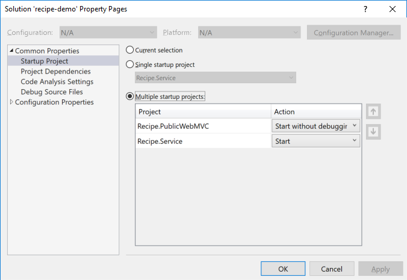

# Multiple Startup Projects
If you have a solution with mulitple projects Visual Studio can launch any number of those projects when you press *F5* in the IDE. 

1. In *Solution Explorer* find the solution, root, node.

2. *Right Click* -> *Properties* - It's the last item on the context menu.

3. In the dialog that appears choose *Multiple startup projects*.

4. Set `Recipe.PublicWebMVC` to `Start without debugger` and `Recipe.Service` to `Start`.

5. Now press *F5* and you should see two browsers launches at the startup page for each project.