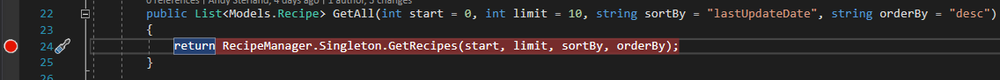
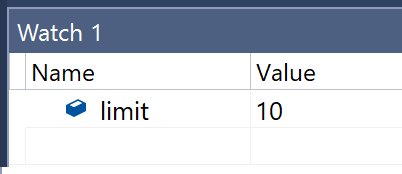
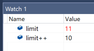
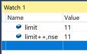

## No Side Effect Expression Evaluation
Adding an expression to the watch window(s) will cause that expression to be evaluated in the context of where the debugger is paused. This is great, it allows you to inspect anything you want, or even execute code, the downside is that it can cause 'side effects' which in this case means you could alter the state of your application. Which is not so great, now normally this doesn't matter as most of the time the expressions you will be evaluating will typically, at worse, just result in a getter getting invoked. As getters should be idempotent and calling them should thus never change the state of your application side effects shouldn't be a problem, but if they are... You can use the `nse` format specifier after the expression, like so:

`<expression>, nse`

### Example: Executing Code in Watch Expressions
In this example we'll be executing some code in a watch expression that will change the state of a variable to illustrate the effect of `,nse` on watches.

1. Navigate to **Recipe.Service** Set a breakpoint at **line 24** in **Controllers/RecipesController.cs**.



2. Launch the application and navigate to the root page. This should cause the controller above to run and the breakpoint to hit.

3. Back in VS go to the **Watch Window** and enter the expression `limit`.



4. Add a new watch with the expression `limit++` this will cause the value of `limit` to increment.



5. Clear the `limit++` watch.

6. Add a new watch with the expression `limit++, nse`.



7. Note how the value of limit is not increment again and stays at it's previous value.


### Example: Getters with Side Effects
In this example we have some crazy code that is using an IEnumerator in a getter property to return an item. The problem with this approach is that every time the property is accessed the getter will cause the iterator to move to the next item. 

```
private IEnumerator<long?> keysEnumerator;
public Recipe NextRecipe
{
    get
    {
        if (!keysEnumerator.MoveNext())
        {
            keysEnumerator.Reset();
        }

        return Recipes[keysEnumerator.Current];
    }
    set { }
}
```
**Warning: The above is an insane property - getters should be idempotent.**

1. In the **Recipe.Service** project, set a breakpoint in `Models/RecipeManager.cs` **line 86**.
2. Navigate to the home page which should cause the breakpoint to hit.
3. In the watch window add the expression `RecipeManager.Singleton.NextRecipe, nse`.
4. Inspect the item. 

This illustrates how `, nse` works. You can think of `,nse` as executing the code involved but without writting back to your application. So in this case when you look an item with `,nse` you get the next item every time you inspect the object but your application isn't changed. 