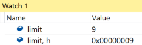
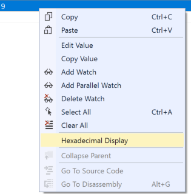

## Number Formatting
In the watch window you can force the visualization of an int into either it's decimal or hexadecimal representation with the respective `,d` and `,h` format specifiers. This is especially useful for looking at values derived from HRESULTS.

1. Navigate to the **Recipe.Service** project and in **Models/RecipeManager.cs**, set a breakpoint on **line 69** in the `GetRecipes()` function. 

2. Launch the application and hit the breakpoint.
3. Add a watch value of `limit`.
4. Add a watch value of `limit, h` to see the hexadecimal representation of `limit`.

### Context Menu
You can also accomplish the same thing with the **Hexadecimal Display** context menu item for a watch.

