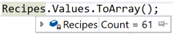
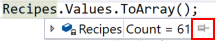

# Pinabble Datatips
When you hover over a variable in Visual Studio a datatip is displayed that allows you to inspect the object. Datatips are dimissed when you move the mouse cursor outside the datatip, which can be frustrating. If you want to keep the datatip around just use the pin icon on the left to 'pin' it in the editor and keep it in place.

1. When paused in the debugger. 
2. Hover over a variable. 

3. Use the 'pin' icon on the righthand side of the data tip (highlighted in red below).

4. Use the datatip to your hearts content.

