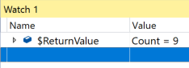
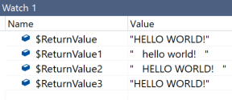

# Return Values In Watch - `$ReturnValue`
In Visual Studio the watch window supports a number of [pseudovariables](https://docs.microsoft.com/en-us/visualstudio/debugger/pseudovariables) which can be used to inspect objects that are not part of the app being debugged. One of those pseudovariables is `$ReturnValue` which shows the return value for a function.

## Simple Example
1. Set a breakpoint on `RecipeManager.cs` line `55` in the `GetRecipes`. 

2. Launch the project and hit the breakpoint.
3. Press *Step Over* / *F10*
4. In the watch window add the expression `$ReturnValue`. You can now inspect the value that is being returned to the caller.

## Mulitple Returns
In addition to seeing the return value from a single finction you can also use the `$ReturnValue` pseudovariables to view the return values from chained expressions e.g. `foo().bar()`. Simply append a number that coresponds to methods place in the chained expression in the `foo().bar()` example the return value for `foo()` would be `$ReturnValue1` and the return value for `bar()` would be `$ReturnValue2`.

1. Add the example code below to `RecipeManager.cs` line `54`.

`var temp = "   Hello world!   ".ToLower().ToUpper().Trim();`

2. Set a breakpoint on the newly added code at line `54`.
3. Launch the project and hit the breakpoint.
4. In the watch window add the expressions `$ReturnValue`, `$ReturnValue1`,`$ReturnValue2`, and `$ReturnValue3`. 
5. Press *Step Over* / *F10*

5. You can see that each of the `$ReturnValue{N}` corespond to the return values for each of the chained functions. 
