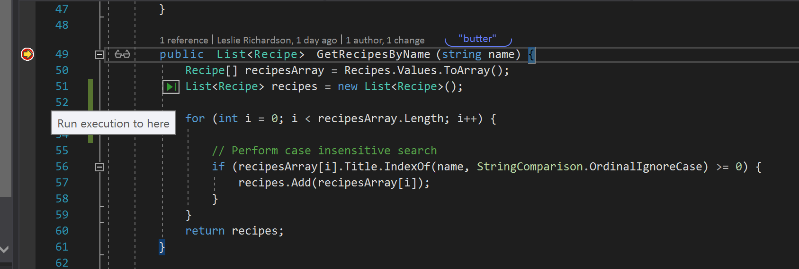

# Run To Click
An alternative to Run to Cursor is **Run to Click**.  Instead of using a context menu or keyboard shortcut to run execution to a specified line of code, Run to Click allows you to perform the same task by a simple point and click.

1.	In the **Recipe.Service** project, navigate to the **GetRecipesByName()** function in **Models/RecipeManager.cs** file.

2.	Set a breakpoint at **line 49** and run the application.

3.	In the recipe application’s search box, enter **“butter”**. Execute the search.

4.	In Visual Studio, hover over **line 51** and select the green arrow **“Run to Execution Here”** glyph that appears on the left side of the code.

5.	Hover over the recipes array in **line 51** and check that it’s null in the DataTip.

6.	Hover over line 61 and select the **“Run to Execution Here”** glyph.

7.	Hover over the recipes array at **line 60** to view its DataTip and check that the size is 3, the corresponding number of matching recipes found in the application containing “butter” in their names.