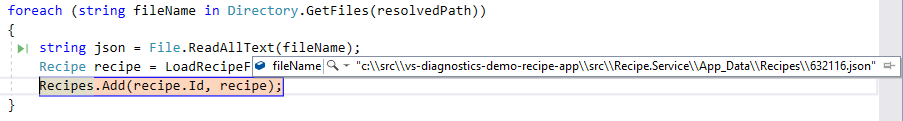

## IntelliTrace - Step Back
The **Step Back** feature of IntelliTrace allows you to inspect the state of your application at a previous point in time. This is really powerful if you want to go back and look at a particular state without having to rerun your scenario.

### Prerequisites
1. To enable Step Back follow the steps to [Enable Snapshots](EnableSnapshots.md).
2. Enable debugging only for **Recipe.Service** using the [Multiple Startup Projects Dialog](MultipleStartupProjects.md) (i.e. set the other two projects to **"Start without debugging"**.

### Step Back Example  

1. Set a breakpoint inside the `foreach` loop in **RecipeManager.cs line 36** in the constructor for `RecipeManager`. 

2. Launch the application and hit the breakpoint.
3. Press **Continue (F5)**. Each time the breakpoint is hit, a snapshot is taken, which can be viewed in the **Diagnostics Tools --> Events** tab. 
4. Inspect the `fileName` variable and take note of it's value.

5. Press **Step Back (Alt + [)**.

6. Inspect the `fileName` variable. Take note of its value and how it's the value from the previous iteration of the `foreach` loop.

