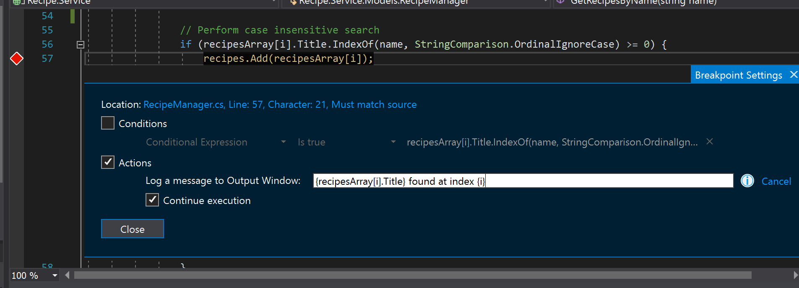

# Tracepoints
**Tracepoints** are breakpoints that allow you to print messages and values to the output window without having to halt program execution or break at that specific point while debugging.

1.	Using the same breakpoint made during the conditional breakpoint exercise, hover over the breakpoint and select the **Settings** gear icon that appears.

2.	Check the **Actions** option and enter the following in the **"Log a Message to Output Window"** textbox:

    `{recipesArray[i].Title} found at index {i}`

    The curly braces around the entered variables indicate that the variable’s value will be printed to the output window.  For more information about additional keywords that can used in tracepoints, hover over the info icon to the right of the textbox.

3.	Hit **ENTER** to save the tracepoint log message and make sure **“Continue Execution”** is checked so that a break does not occur every time a message is logged.  Uncheck the **Conditions** option if it isn’t unchecked already and select the **Close** button to exit the menu.

4.	Restart the application and search for “chocolate” in the search box.

5.	In Visual Studio’s **Output Window**, hit **Ctrl+F** and enter “chocolate peanut” in the search box to locate the log messages you created with the tracepoint.

